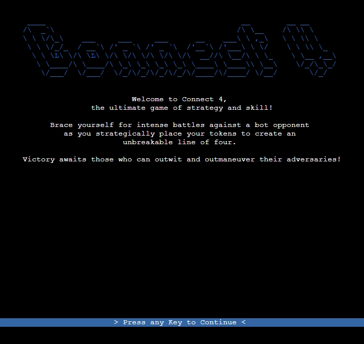
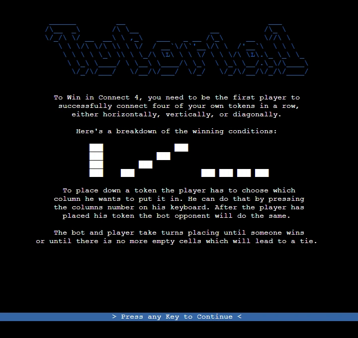
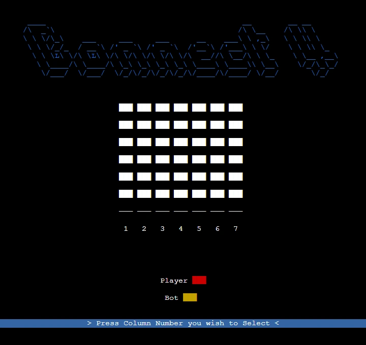

# Connect4 Terminal Game

Terminal Connect4 is a Python implementation of the classic game Connect4, designed to be played in the terminal. This project allows you to enjoy the popular two-player game against a bot opponent, providing a challenging and interactive experience right from your command line.

- [Connect4 Terminal Game](#connect4-terminal-game)
  * [Features](#features)
    * [Existing Features](#existing-features)
    * [Features Left to Implement](#features-left-to-implement)
  * [Data Model](#data-model)
  * [Testing](#testing)
    * [Unfixed Bugs](#unfixed-bugs)
    * [Validator Testing](#validator-testing)
  * [Deployment](#deployment)
  * [Development](#development)
    * [Technologies Used](#technologies-used)
    * [External Python Packages Used](#external-python-packages-used)
  * [Credits](#credits)
    * [Content](#content)
    * [Media](#media)

## Features

### Existing Features

  - Terminal User Interface
    - A terminal was used as a means to display the state of the game and allow users to interact with it.
    - To improve user experience the terminal app library [blessed](https://pypi.org/project/blessed/) was used which allowed for better visuals and easier input handling.
    - To allow for a easier and more modular way of displaying the state of a [Game](https://github.com/DebuggedMoon/terminal-connect4/blob/main/game.py), the [TerminalGame](https://github.com/DebuggedMoon/terminal-connect4/blob/main/terminalgame.py) class was written to handle everything Terminal and [blessed](https://pypi.org/project/blessed/) related.
    - The Terminal UI controls and switches between a number of screens to achieve more of a video game feeling:
      - The `Starting Screen` welcomes players and gives a short and hyped summary of the game.
        
      - The `Tutorial Screen` gives the player information about the game and teaches them on how to play it.
        
      - The `Game Screen` displays the playfield of the game and gives the user feedback for his input.
        

## Testing

### Unfixed Bugs

### Validator Testing 

## Deployment

## Development

### Technologies Used

### External Python Packages Used

## Credits

### Content

### Media